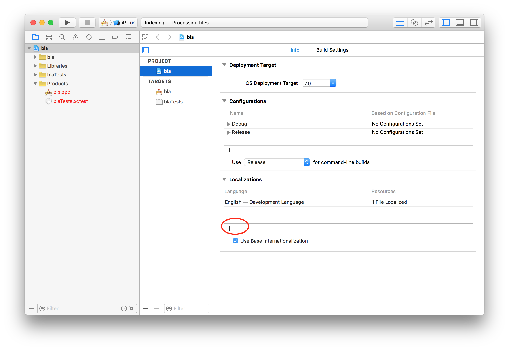

# react-native-i18n

Integrates [I18n.js](https://github.com/fnando/i18n-js) with React Native. Uses the device's locale as default.

## Installation

`$ npm install react-native-i18n --save`

### iOS

Add `RNI18n.xcodeproj` to **Libraries** and add `libRNI18n.a` to **Link Binary With Libraries** under **Build Phases**. [More info and screenshots about how to do this is available in the React Native documentation](http://facebook.github.io/react-native/docs/linking-libraries-ios.html#content).

You also need to add the **localizations** you intend to support to the iOS project. To do that
open

```
$ open <your-project>.xcodeproj
```

And add the localizations you will support as shown here:



### Android

Add `react-native-i18n` to your `./android/settings.gradle` file as follows:

```
include ':app', ':react-native-i18n'
project(':react-native-i18n').projectDir = new File(rootProject.projectDir, '../node_modules/react-native-i18n/android')
```

Include it as dependency in `./android/app/build.gradle` file:

```
dependencies {
    ...
    compile project(':react-native-i18n')
}
```

Finally, you need to add the package within the `ReactInstanceManager` of your MainActivity (`./android/app/src/main/java/your/bundle/MainActivity.java`):

```java

import com.i18n.reactnativei18n.ReactNativeI18n;  // <---- import this one

...


@Override
protected void onCreate(Bundle savedInstanceState) {
	...

	mReactInstanceManager = ReactInstanceManager.builder()
	.setApplication(getApplication())
	.addPackage(new ReactNativeI18n())  // <---- add this line
	.build();

	...
}

...

```


After that, you will need to recompile your project with `react-native run-android`.

## Usage

```js
var I18n = require('react-native-i18n');

var Demo = React.createClass({
  render: function() {
    return (
      <Text>{I18n.t('greeting')}</Text>
    )
  }
});

// Enable fallbacks if you want `en-US` and `en-GB` to fallback to `en`
I18n.fallbacks = true;

I18n.translations = {
  en: {
    greeting: 'Hi!'
  },
  fr: {
    greeting: 'Bonjour!'
  }
}
```

This will render `Hi!` for devices with the English locale, and `Bonjour!` for devices with the French locale.

### Fallbacks
When fallbacks are enabled (which is generally recommended), `i18n.js` will try to look up translations in the following order (for a device with `en_US` locale):
- en-US
- en

**Note**: iOS locales use underscored (`en_US`) but `i18n.js` locales are dasherized (`en-US`). This conversion is done automatically for you.
```js
I18n.fallbacks = true;

I18n.translations = {
  'en': {
    greeting: 'Hi!'
  },
  'en-GB': {
    greeting: 'Hi from the UK!'
  }
}
```
For a device with a `en_GB` locale this will return `Hi from the UK!'`, for a device with a `en_US` locale it will return `Hi!`.

### Device's locale

You can get the device's locale with the `RNI18n` native module:

```js
var deviceLocale = require('react-native').NativeModules.RNI18n.locale
```

Returns `en_US`. You can also do:

```js
var I18n = require('react-native-i18n');
var deviceLocale = I18n.locale;
```

Returns `en-US`.


### I18n.js documentation
For more info about I18n.js methods (`localize`, `pluralize`, etc) and settings see [its documentation](https://github.com/fnando/i18n-js#setting-up).

## Licence
MIT
